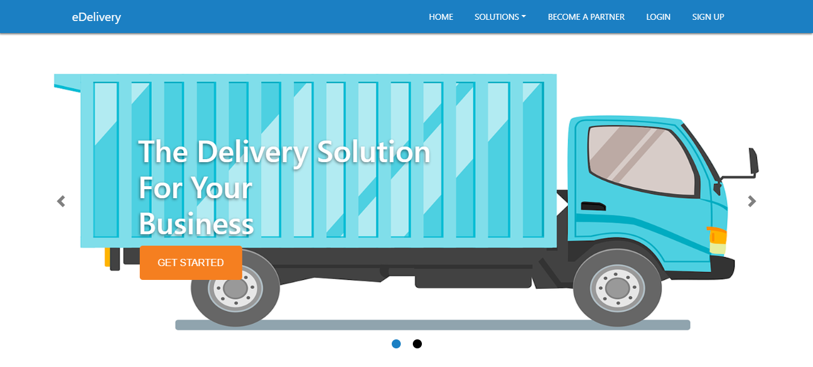
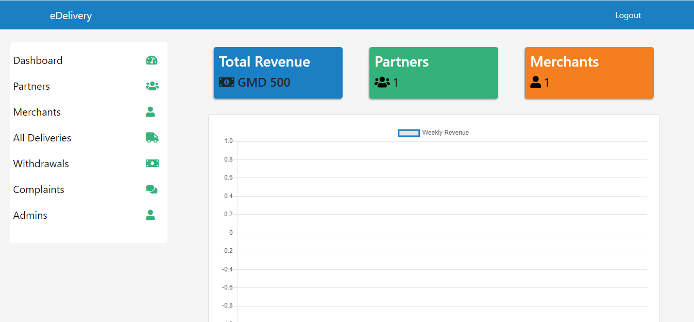

# What is eDelivery
 eDelivery is a web application which enable merchant's to make delivery requests and have it delivered on their behalf to their desired destination all through the web app.
# eDelivery Homepage

# Merchant Dashboard

# Partner Dashboard

# Admin Dashboard

# Tech Stack
### Frontend
  - HTML
  - CSS/SASS
  - JAVASCRIPT (jQuery)
### Backend
  - PHP
  - SQL
### Backend API
  - Slim Framework
### Web Server Setup
  - nginx as a reverse proxy for apache
  - Ubuntu 19.04 LTS
### Live Website
[eDelivery](https://www.edelivery.xyz)
