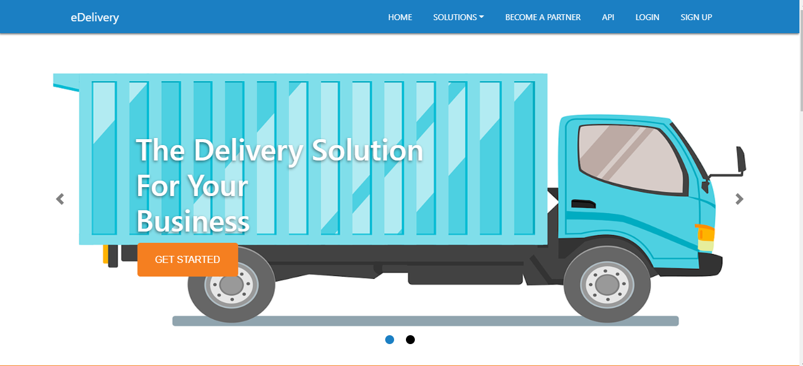
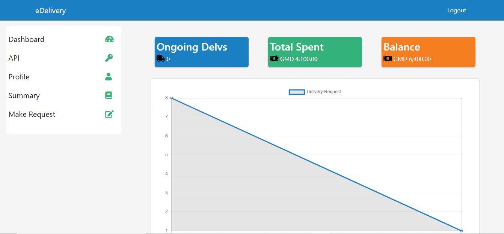
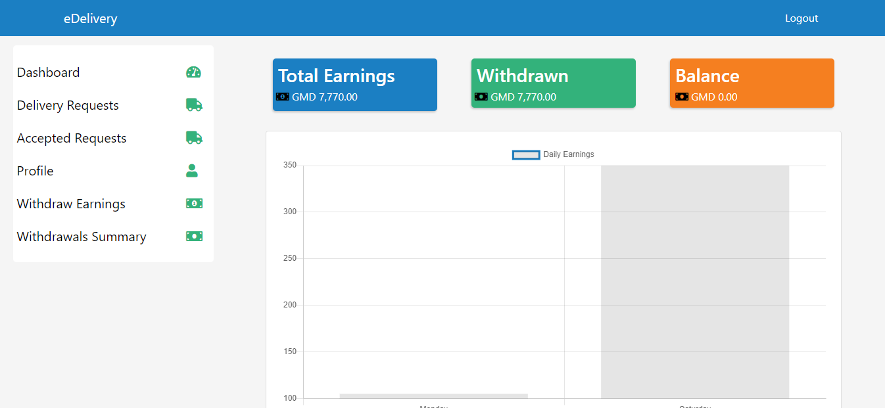

# What is eDelivery
 eDelivery is a web application which enable merchant's to make delivery requests and have it delivered on their behalf to their desired destination all through the web app.
# eDelivery Homepage

# Merchant Dashboard

# Partner Dashboard

# Tech Stack
### Frontend
  - HTML
  - CSS/SASS
  - JAVASCRIPT (jQuery)
### Backend
  - PHP
  - SQL
### Backend API
  - Slim Framework
